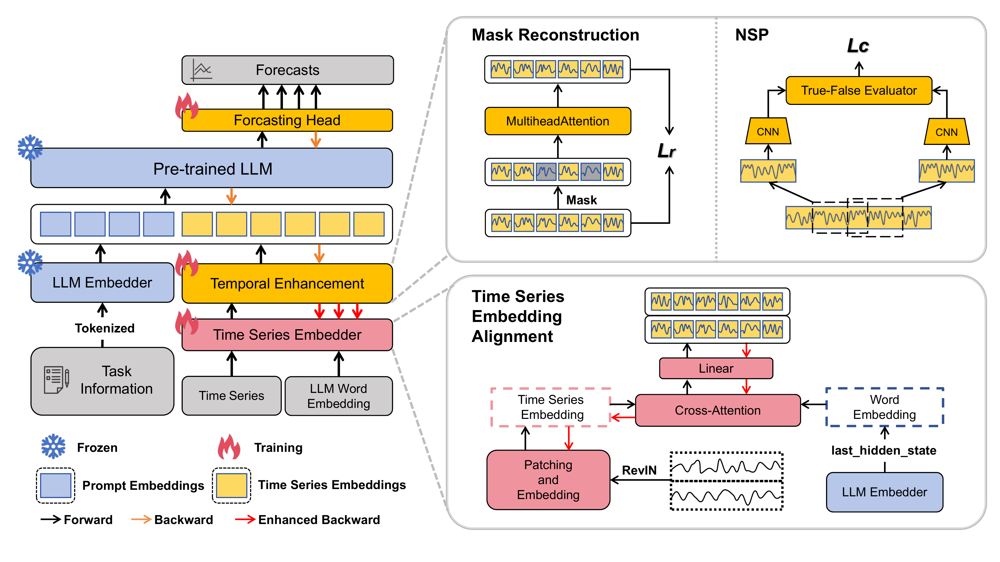

# RTS-LLM: Restoring Time Structure for Time Series Forecasting with LLMs

[](https://www.python.org/)
[](https://pytorch.org/)
[](LICENSE)
[](https://doi.org/10.1016/j.eswa.2025.130402)

Official PyTorch implementation of the paper **"RTS-LLM: Restoring time structure for time series forecasting with LLMs"**, published in **Expert Systems with Applications (ESWA), 2026**.

---

## 📢 News
* **[2026-06]** Pre-trained checkpoints for ECL, ETTm1, and Weather are released!
* **[2025-11]** RTS-LLM is accepted by **Expert Systems with Applications (ESWA)**!

---

## 🌟 Overview
Adapting pre-trained Large Language Models (LLMs) for time series forecasting is highly promising but challenging due to the difficulty of preserving intrinsic temporal characteristics when aligning time series embeddings with semantic representations.

**RTS-LLM** is a novel framework that bridges the gap between time series forecasting and pre-trained LLMs through a dual focus on **cross-modal alignment** and **Time Structure Restoration**, while keeping the parameters of the LLM backbone **completely frozen** to fully exploit pre-trained capabilities and significantly reduce training costs.

### Key Contributions
1. **Cross-Modal Alignment Module**: Aligns patched time series embeddings with pre-trained word embeddings via multi-head cross-attention, enabling compatibility with frozen LLM encoders.
2. **Time Structure Restoration (TSR)**: Introduces two complementary self-supervised tasks:
   - **Mask Reconstruction (MR)**: Randomly masks patches to force the model to capture short-term temporal dependencies and preserve local continuity.
   - **Next Series Prediction (NSP)**: Operates on complete segments to classify consecutive vs. non-consecutive segments, restoring global dependencies like seasonality, trends, and periodicity.
3. **State-of-the-Art Efficiency & Performance**: Achieves superior forecasting accuracy while requiring significantly fewer trainable parameters and lower GPU memory (VRAM) compared to fine-tuned LLM baselines.

---

## 📐 Architecture
The overall architecture of RTS-LLM is shown below:



*Note: The input sequence is normalized by RevIN and partitioned into overlapping patches. After cross-modal alignment, the Mask Reconstruction and Next Series Prediction tasks are jointly optimized to restore temporal structures. Finally, aligned embeddings concatenated with prefix prompts are processed by the frozen LLM for multi-step forecasting.*

---

## 🛠️ Installation & Setup

### Requirements
- Python >= 3.11
- PyTorch >= 2.0 (with CUDA support)

### Quick Install
1. Clone this repository and navigate to the root directory.
2. Create and activate a conda environment:
   ```bash
   conda create -n RTS-LLM python=3.11 -y
   conda activate RTS-LLM
   ```
3. Install the packages in editable mode:
   ```bash
   pip install -e .
   ```
4. Install `mpi4py` via Conda (highly recommended for parallel utilities):
   ```bash
   conda install mpi4py -y
   ```

---

## 📅 Datasets Preparation
Download the pre-processed datasets from [[Google Drive]](https://drive.google.com/file/d/1NF7VEefXCmXuWNbnNe858WvQAkJ_7wuP/view?usp=sharing) and place them under the `./dataset` directory.

The expected folder structure is as follows:
```
RTS-LLM/
├── dataset/
│   ├── electricity/
│   │   └── electricity.csv
│   ├── ETT-small/
│   │   ├── ETTh1.csv
│   │   ├── ETTh2.csv
│   │   ├── ETTm1.csv
│   │   └── ETTm2.csv
│   └── weather/
│       └── weather.csv
```

---

## 🚀 Quick Replication (Evaluation)
We provide pre-trained checkpoints for ETTm1, Weather, and Electricity (ECL) datasets. To replicate our paper's results:

### 1. Download Checkpoints
Download the zip files from the [Releases](https://github.com/Taihuachen-cfair/RTS-LLM/releases) page:
* [[ETTm1 Checkpoints]](https://github.com/Taihuachen-cfair/RTS-LLM/releases/download/v1.0.0/ETTm1.zip)
* [[Weather Checkpoints]](https://github.com/Taihuachen-cfair/RTS-LLM/releases/download/v1.0.0/Weather.zip)
* [[ECL Checkpoints]](https://github.com/Taihuachen-cfair/RTS-LLM/releases/download/v1.0.0/ECL.zip)

Unzip them into the `./rts_ckpt/` folder:
```bash
mkdir -p ./rts_ckpt
unzip ETTm1.zip -d ./rts_ckpt/
unzip Weather.zip -d ./rts_ckpt/
unzip ECL.zip -d ./rts_ckpt/
```

### 2. Run Evaluation Scripts
Execute the evaluation shells directly:
```bash
# Evaluate ETTm1
bash ./scripts/eval/ETTm1.sh

# Evaluate Weather
bash ./scripts/eval/Weather.sh

# Evaluate ECL
bash ./scripts/eval/ECL.sh
```

---

## 🏋️ Model Training
To train the model from scratch on ETTm1, ETTm2, or Weather datasets, run:
```bash
# Train ETTm1
bash ./scripts/train/ETTm1.sh

# Train ETTm2
bash ./scripts/train/ETTm2.sh

# Train Weather
bash ./scripts/train/Weather.sh
```
Check `run_main.py` and `run_m4.py` for comprehensive parameter configurations and details.

---

## 📝 Citation
If you find our work or code useful in your research, please cite our paper:

```bibtex
@article{chen2026rts,
  title={RTS-LLM: Restoring time structure for time series forecasting with LLMs},
  author={Chen, Taihua and Cui, Lizhen and Ma, Xiang and Xu, Yanyu and Xu, Yonghui and Qian, Shuyuan},
  journal={Expert Systems with Applications},
  volume={301},
  pages={130402},
  year={2026},
  publisher={Elsevier},
  doi={10.1016/j.eswa.2025.130402}
}
```

---

## 🙏 Acknowledgements
We appreciate the following repositories for their valuable open-source codebases:
* [Time-Series-Library (TSLib)](https://github.com/thuml/Time-Series-Library)
* [Time-LLM](https://github.com/KimMeen/Time-LLM)
* [OFA (GPT4TS)](https://github.com/DAMO-DI-ML/NeurIPS2023-One-Fits-All)
